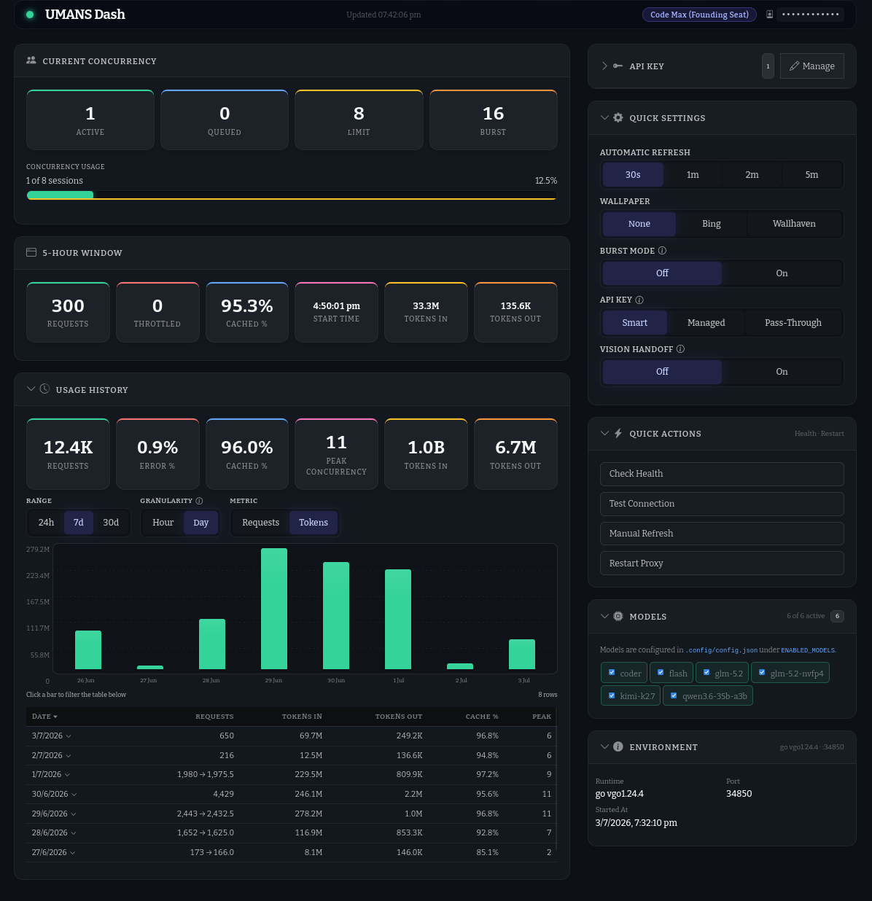
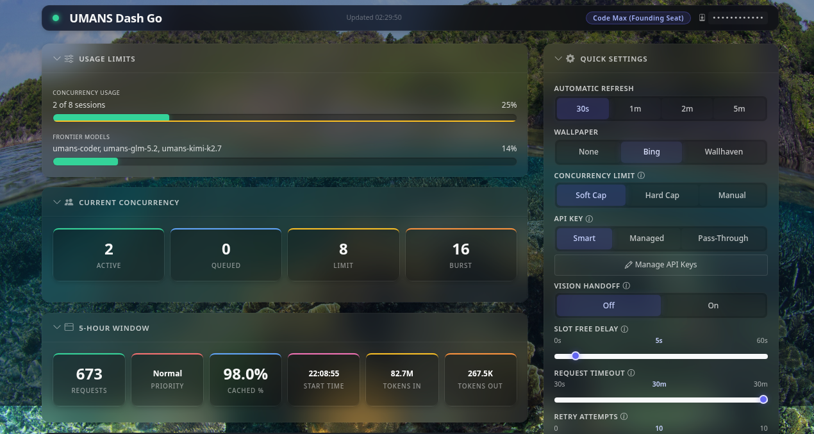

# UMANS-Dash-Go

OpenAI- and Anthropic-compatible proxy for [UMANS AI](https://code.umans.ai), written in Go. Zero external dependencies.

This is a Go port and opinionated customization of the original Node.js project at [https://github.com/notBlubbll/umans-dash](https://github.com/notBlubbll/umans-dash).





## Features

- **OpenAI-Compatible API** — Drop-in for `/v1/chat/completions` and `/v1/models`
- **Anthropic Messages API** — Pass-through for `/v1/messages` (Anthropic-compatible clients)
- **Multi-Key Pool** — Round-robin key pool with unhealthy marking, cooldowns, and persistence across restarts
- **Automatic Upstream Retry** — Retries failed requests on HTTP 500/503 and network failures up to 10 times with escalating backoff, rotating to a fresh key on each attempt
- **Concurrency Queue** — Bounded request queue gated by Burst Mode (soft cap when Off, hard cap when On), with soft-limit (limit) and hard-cap (burst) tracking, throttled-503 counter, and rejection when full
- **Dashboard** — Clean UI with usage cards, concurrency monitoring, usage history chart with sortable tables, model management, key management, and configuration
- **API Key Mode** — Smart (default), Managed, or Pass-Through mode controlling which API key is used for upstream requests (client key vs. proxy key pool)
- **Burst Mode** — Dashboard toggle that controls backend concurrency gating: Off gates at the soft cap (Limit), On gates at the hard cap (Burst); persisted in config and synced to the frontend
- **Non-Blocking Config Updates** — Proxy request handlers snapshot config fields and release the config lock immediately, so settings changes complete instantly even during active LLM completions
- **Bing Wallpaper** — Daily rotating UHD (3840px) backgrounds from Bing
- **Wallhaven Wallpaper** — Optional high-resolution (≥2560×1440) backgrounds from Wallhaven with JPEG, PNG, and WebP support
- **Automatic Image-Attachment Limit** — Caps vision/images per request; excess images are pruned oldest-first before forwarding to UMANS
- **Vision Handoff** — Models that can't see images natively (e.g. GLM 5.2) automatically delegate image analysis to a vision-capable model (default `umans-coder`) and inject the text description into the session context
- **Handoff Image Cache** — When vision handoff is enabled, caches image descriptions for 24 hours so repeated images skip re-analysis
- **Thinking Payload Normalization** — Rewrites camelCase `budgetTokens` back to snake_case `budget_tokens` for UMANS Pydantic compatibility
- **Tool Schema Normalization** — Simplifies `anyOf`/nullable combinators and resolves `$ref` references before forwarding

## Project Layout

```
umans-dash-go/
├── cmd/umans-dash-go/
│   └── main.go        # Entry point (config load, HTTP server, graceful shutdown)
├── proxy.go           # Full proxy implementation (handlers, upstream client, queues, caching)
├── types.go           # Type definitions (Config, KeyPool, Proxy, etc.)
├── dashboard.html     # Dashboard UI
├── go.mod             # Go module definition (stdlib only)
├── SPEC.md            # Technical specification
└── AGENTS.md          # Developer guide
```

## Differences from the Original Node.js Version

- **Single Go binary** — no Node.js runtime, no `npm install`, no `node_modules`
- **Zero external dependencies** — uses only the Go standard library
- **Excluded features** (present in the upstream original, removed in this port):
  - FreeGen AI wallpaper generator (and `/api/bg-freegen` endpoint)
  - Sleev context-compression gateway
  - Shell Guard (git-command blocking in tool-call responses)
  - i18n autotranslation system (`/api/i18n`, `LOCALE` config)
  - Response cache for non-streaming chat (`/api/cache`, `CACHE_TTL`/`CACHE_MAX_SIZE`/`CACHE_ENABLED`)
  - UMANS app login (`EMAIL`/`PASSWORD`/`APP_SESSION`, `/api/umans/login`, `/api/umans/logout`)
  - Per-model rate limit map (`RATE_LIMIT_MAP`)
  - Test Chat panel in the dashboard
  - SS Mode (screenshot-safe blur/masking)
  - SVG-filter glassmorphism (replaced with CSS `backdrop-filter`)
  - SQLite usage-history cache (`.cache/usage.db`)
- **Added features** (not in the upstream original):
  - API Key Mode (Smart / Managed / Pass-Through) controlling which key is sent upstream
  - Burst Mode toggle (soft cap vs. hard cap concurrency gating), persisted to config
  - Non-blocking config updates (request handlers snapshot config fields and release the lock immediately)
  - Vision Handoff Image Cache (SHA-256 keyed LRU, 24h TTL, configurable)
  - Models.dev integration for reasoning metadata and display-name enrichment
  - Thinking payload normalization (`budgetTokens` → `budget_tokens` for UMANS Pydantic compatibility)
  - `DISABLED_MODELS` config field to hide specific models from the catalog
  - `/v1/models/info` endpoint exposing the raw upstream model catalog
  - UHD Bing wallpaper (3840px peapix resolution upgrade)
  - Wallhaven resolution filter (`atleast=2560x1440`) with JPEG/PNG/WebP content-type detection
  - Redesigned dashboard UI (unified refresh cycle, concurrency card with burst-zone visualization, sortable usage history with per-model drill-down)
- **Wallpaper sources:** `none`, `bing`, or `wallhaven` only
- **Default listen address:** `127.0.0.1:8084` (the packaged systemd service runs on `127.0.0.1:34850`)

## Quick Start

### Prerequisites

- Go 1.22 or later

### 1. Get a UMANS API Key

1. Go to **[app.umans.ai](https://app.umans.ai)** and sign up or log in.
2. Navigate to the **API Keys** section.
3. Click **Create API Key** — you'll get a key starting with `sk-...`.
4. Copy this key — it will be used by the proxy.

### 2. Configure the Proxy

Edit `.config/config.json` and set your API key:

```json
{
  "API_KEY": "sk-..."
}
```

Or via environment variable:

```bash
export UMANS_API_KEY=sk-...
```

### 3. Build and Run

```bash
go build -o umans-dash-go ./cmd/umans-dash-go/
./umans-dash-go
```

For development you can also run directly:

```bash
go run ./cmd/umans-dash-go/
```

### 4. Add Models

Edit `.config/config.json` and add the model IDs you want to expose to the `ENABLED_MODELS` array:

```json
{
  "ENABLED_MODELS": ["qwen3-coder", "deepseek-v4-pro"]
}
```

Restart the proxy for the change to take effect.

### 5. Use with Any OpenAI Client

```javascript
import OpenAI from 'openai';

const client = new OpenAI({
  apiKey: 'ignored',
  baseURL: 'http://127.0.0.1:8084/v1'
});

const response = await client.chat.completions.create({
  model: 'qwen3-coder', // must be in your enabled models list
  messages: [{ role: 'user', content: 'Hello!' }]
});
```

### Anthropic-compatible clients

The proxy also exposes `/v1/messages` for Anthropic-format clients:

```javascript
import Anthropic from '@anthropic-ai/sdk';

const client = new Anthropic({
  apiKey: 'ignored',
  baseURL: 'http://127.0.0.1:8084/v1'
});

const response = await client.messages.create({
  model: 'umans-kimi-k2.7',
  max_tokens: 4096,
  messages: [{ role: 'user', content: 'Hello!' }]
});
```

## Dashboard

Open **http://127.0.0.1:8084** in your browser.

> **Unified refresh cycle:** Status, usage, concurrency, and history all refresh together on the user-selected Automatic Refresh interval. The interval is persisted in `localStorage` and restored on page load (default 30s).

### Current Concurrency Card
- 4 stat cards: **Active** (green), **Queued** (blue), **Limit** (soft, yellow), **Burst** (hard cap, orange)
- Progress bar with solid fill (proxy active) and dotted overlay (upstream concurrent)
- Bottom-border zone markers: yellow for soft-cap region, orange for burst region
- When Burst Mode is **Off**, the backend gates at the soft cap (Limit) and the bar scales to match. When **On**, the backend gates at the hard cap (Burst) and the bar shows both zones with a green→orange gradient on the fill when active exceeds the soft cap
- Percentage shows value relative to soft cap

### 5-hour Window Card
- **Requests / Throttled / Cached %** — Current window usage with throttled (503 queue-full) count
- Detail grid: Start Time, Tokens In, Tokens Out

### Usage History Card
- Bar chart with Y-axis labels, dashed grid lines, and X-axis labels
- Click a bar to filter the table to that date
- Table shows consolidated per-date rows (Date, Requests, Tokens In, Tokens Out, Cache %, Peak) with sortable headers
- Click a row to expand a per-model detail table (Model, Requests, Tokens In, Tokens Out, Cache %) with its own sortable headers
- Metric toggle (Tokens/Requests) controls chart scale and default sort
- Status legend shown only in Requests mode; hidden in Tokens mode

### API Key (collapsed by default)
- Key pool display with status badges; manage keys via modal
- Hidden in Pass-Through mode (client keys are passed through directly)

### Quick Settings (expanded)
- **Automatic Refresh** — 30s / 1m / 2m / 5m (=298s) interval selector; persisted to `localStorage`
- **Wallpaper** — None / Bing / Wallhaven
- **Burst Mode** — Off / On toggle; Off gates backend concurrency at the soft cap (Limit), On gates at the hard cap (Burst); persisted in config (`BURST_MODE`) and synced to the frontend on load
- **API Key** — Smart / Managed / Pass-Through mode selector
- **Vision Handoff** — Toggle image handoff for vision-incapable models
- **Handoff Cache** — Toggle caching of vision handoff image analyses (shown only when Vision Handoff is enabled)
- Sections collapse with a chevron icon that swaps between `bi-chevron-down` (expanded) and `bi-chevron-right` (collapsed)

### Quick Actions (expanded)
- Health check, connection test, manual refresh, restart proxy

### Models (expanded)
- View and toggle models from the catalog

### Environment (expanded)
- Runtime, Port, Started At

### Wallpaper Rendering
- Desktop: `background-size: cover` (fills the viewport)
- Mobile (≤575px): `background-size: contain` (shows the full image centered)
- Server-side CSS injection includes full background properties (`no-repeat`, `center`, `fixed`, base color)

### Header Bar
- User ID (click-to-reveal, masked by default) and online status indicator

### Mobile Layout
- Right-column sections (Quick Settings, Quick Actions, API Key, Models, Environment) collapse by default on screens ≤575px

## API Key Mode

The proxy supports three modes for selecting which API key is sent to the upstream UMANS API on each request. The mode is configurable from the dashboard's Quick Settings panel and persisted in `config.json` via the `API_KEY_MODE` field.

| Mode | Behavior | Authorization |
|---|---|---|
| **Smart** (default) | Uses the client's API key if one is provided in the request (`Authorization: Bearer <key>` or `X-Api-Key`); falls back to the proxy's own key pool if no client key is present | Accepts all requests |
| **Managed** | Always uses the proxy's own key pool, ignoring any client-supplied key | Validates client requests against the `API_KEYS` allow-list (if configured); open if no allow-list is set |
| **Pass-Through** | Always uses the client's API key, disabling the proxy's key management entirely | Accepts any request that includes an API key |

**Dashboard upstream calls** (usage, concurrency, history) adapt to the active mode:
- **Pass-Through**: uses the last-known-good client key
- **Smart**: prefers the last-known-good client key, falls back to the pool key
- **Managed**: uses the pool key

The **API Key** card is hidden from the dashboard in Pass-Through mode.

## Vision Handoff

Some UMANS models (e.g. `umans-glm-5.2`, `umans-glm-5.1`) are advertised with `supports_vision: "via-handoff"` — they cannot process images natively. The proxy transparently bridges this gap:

1. When a request to a `via-handoff` model contains images, the proxy extracts them (OpenAI `image_url` and Anthropic `image` parts, including nested tool-result blocks).
2. Each image is sent to the **handoff model** (default `umans-coder`) with an analysis prompt.
3. If the handoff cache is enabled, the proxy checks a SHA-256 hash of the image data URI against the `ImageHandoffCache` first. On cache hit, the cached description is reused without calling upstream. On miss, the upstream is called and the result is cached for 24 hours.
4. Images are analyzed in parallel and replaced in-place with `{type: "text", text: "[Image content — analyzed by vision module, shown as text because the active model cannot see images:]\n<description>"}` blocks.
5. The modified payload (now text-only) is forwarded to the originally requested model.

The handoff applies to both the OpenAI (`/v1/chat/completions`) and Anthropic (`/v1/messages`) paths, running after model resolution and before the upstream call.

**Config keys:**

| Field | Description | Default |
|---|---|---|
| `VISION_HANDOFF_ENABLED` | Toggle the handoff for all `via-handoff` models | `false` |
| `VISION_HANDOFF_MODEL` | Vision-capable model used to analyze images | `umans-coder` |
| `VISION_HANDOFF_PROMPT` | Custom analysis system prompt (empty = built-in) | — |
| `VISION_HANDOFF_CACHE_ENABLED` | Enable caching of vision handoff image analyses | `false` |
| `VISION_HANDOFF_CACHE_TTL` | TTL for cached vision handoff analyses | `24h` |

The built-in prompt instructs the handoff model to produce a factual, third-person description of the image as a single coherent paragraph — covering image type, visible elements and their spatial arrangement, exact transcription of text/code, and salient technical details.

## API Endpoints

| Method | Path | Description |
|---|---|---|
| `GET` | `/healthz` | Proxy health check (vision handoff status + cache stats) |
| `GET` | `/v1/models` | OpenAI-format model list with pricing and context length |
| `GET` | `/v1/models/info` | Raw model catalog |
| `POST` | `/v1/chat/completions` | OpenAI-format chat completions |
| `POST` | `/v1/messages` | Anthropic Messages API (pass-through to upstream) |
| `GET` | `/api/config` | Get proxy configuration |
| `POST` | `/api/config` | Update proxy configuration |
| `GET` | `/api/validate` | Validate API key |
| `GET` | `/api/models` | List enabled models |
| `GET` | `/api/umans/usage` | UMANS usage data (supports `?fresh=1` to bypass cache) |
| `GET` | `/api/umans/usage-history` | UMANS usage history (supports `from`, `to`, `granularity`, `scope`; `?fresh=1` bypasses cache) |
| `GET` | `/api/umans/concurrency` | Concurrency sessions, limit, hard_cap, active count & queue depth (supports `?fresh=1`) |
| `GET` | `/api/umans/user` | UMANS user info |
| `GET` | `/api/keys` | List API keys |
| `POST` | `/api/keys` | Add/update/delete API keys |
| `GET` | `/api/bg` | Daily Bing wallpaper |
| `GET` | `/api/bg-wallhaven` | Random Wallhaven wallpaper |
| `POST` | `/api/restart` | Restart the proxy |

## Configuration

`.config/config.json` supports:

| Field | Description | Default |
|---|---|---|
| `LISTEN_ADDR` | Proxy listen address | `127.0.0.1:8084` |
| `UPSTREAM_BASE_URL` | UMANS API URL | `https://api.code.umans.ai/v1` |
| `API_KEY` | UMANS API key (`sk-*`) | — |
| `KEYS` | Array of additional API keys for the key pool (name + key) | `[]` |
| `REQUEST_TIMEOUT` | Upstream request timeout | `15m` |
| `ENABLED_MODELS` | Array of model IDs to expose | `[]` |
| `DISABLED_MODELS` | Array of model IDs to hide from the catalog | `[]` |
| `MODEL_DISPLAY_NAMES` | Custom display names per model | `{}` |
| `API_KEYS` | Array of allowed proxy API keys (auth) | `[]` |
| `OVERRIDE_CONCURRENCY` | Override concurrent sessions value (0 = auto-detect from API; capped to min of override and upstream hard_cap) | `0` |
| `MAX_IMAGES` | Maximum image attachments per forwarded request; oldest images are dropped first | `9` |
| `VISION_HANDOFF_ENABLED` | Enable image handoff for vision-incapable models | `false` |
| `VISION_HANDOFF_MODEL` | Vision-capable model used to analyze images during handoff | `umans-coder` |
| `VISION_HANDOFF_PROMPT` | Custom analysis prompt for the handoff model (empty = built-in) | — |
| `VISION_HANDOFF_CACHE_ENABLED` | Enable caching of vision handoff image analyses | `false` |
| `VISION_HANDOFF_CACHE_TTL` | TTL for cached vision handoff analyses | `24h` |
| `wallpaperSource` | Dashboard wallpaper source: `none`, `bing`, or `wallhaven` | `bing` |
| `API_KEY_MODE` | API key selection mode: `smart`, `managed`, or `passthrough` | `smart` |
| `BURST_MODE` | Burst mode toggle: `true` gates concurrency at the hard cap, `false` gates at the soft cap | `false` |

## Building and Development

```bash
# Compile check
go build ./...

# Static analysis
go vet ./...

# Run directly
go run ./cmd/umans-dash-go/

# Build binary
go build -o umans-dash-go ./cmd/umans-dash-go/
```

## License

This project is licensed under the MIT License — see [LICENSE](LICENSE) for details.
